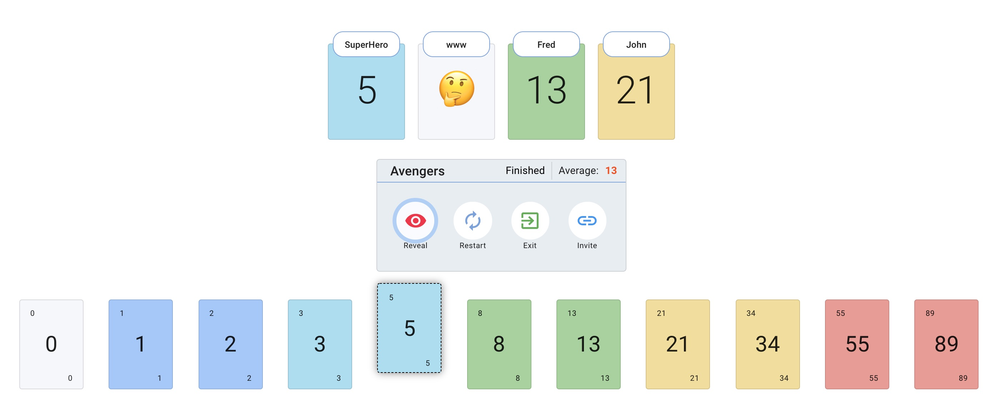

<h1 align="center">Planning Poker App</h1>

Scrum/Agile Planning Poker Web App to estimate user stories for the Agile/Scrum teams. Create session and invite team members to estimate user stories efficiently. Intuitive UI/UX for voting the story points, showing team members voting status with emojis(👍 - Voting Done, 🤔 - Yet to Vote). Session Moderator has full control on revealing story points and restarting the session.

  

## Home Page

## Active Session

## Features

1. Create new Session(Fibonacci or TShirt size)
2. Join Session
3. Invite Link
4. Session controller - Moderator can Reveal and restart the session anytime.
5. Reveal - Reveal the cards for all users
6. Voting status - Users Cards show voting status using emojis - 👍 - Voting Done, 🤔 - Yet to Vote

## Tech Stack

1. React - Frontend
2. Material-ui - UI Components
3. Firestore - Database
4. Firebase - Hosting

## How to run the app locally for development

1. Clone the repo
2. Run `yarn` command to install the required npm package.
3. Run `yarn start` to start the app.
4. Access the app at `http://localhost:3000`.
5. We use the same production database for local development too, so avoid creating too many new sessions and re-use existing one.

